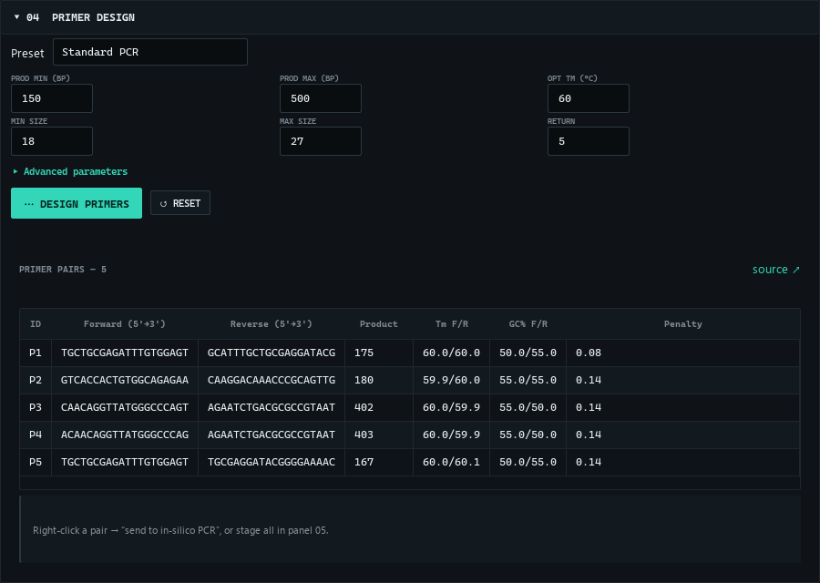
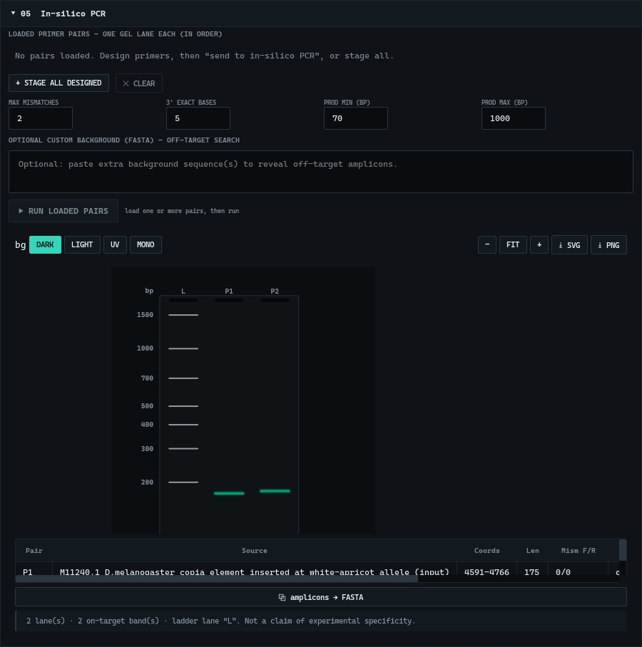

<div align="center">
<picture>
  <source media="(prefers-color-scheme: dark)" srcset="docs/img/teagle-banner-dark.png">
  
</picture>

   
</div>

Paste a sequence, open a FASTA file, or fetch an NCBI accession; detect and classify transposable elements with full evidence provenance; explore the results in an interactive genome viewer; and design purpose-specific PCR primers checked by pair-aware in-silico PCR with a to-scale gel — all in a native window, without a command line, and with every result reproducible from the exact database and software versions that produced it.

TEagle is a **native PySide6/Qt application**. The scientific core (sequence parsing, structural detection, HMMER protein-domain scanning, superfamily classification, Primer3 design, in-silico PCR, provenance) runs in-process — no browser, no local web server, no internet needed for the core workflow.


> **License:** TEagle is proprietary software. The source here is provided for reference and transparency; it is **not** open-source. You may download and run the official release for personal, academic, or research use, but redistribution, modification, and reverse-engineering are not permitted. See [LICENSE](LICENSE).

---

## Install and run — no setup, nothing to configure

For a wetlab researcher or anyone who does not want to touch code:

1. Download **`TEagle-Setup-<version>.exe`** from the [Releases](../../releases) page.
2. Run it (per-user install, no admin needed) and launch **TEagle**.
3. Paste a sequence, open a FASTA, or type an accession → **Run analysis**.

Everything the science needs — Python, PySide6, Primer3, HMMER (pyhmmer), and the CC0 Pfam TE-domain profiles — is bundled inside the app. There is nothing to `pip install`, no Python to set up, no command line. The app is a windowed build: it runs its background helpers silently, with no console or terminal windows flashing.

**Optional advanced features** (Dfam family-level naming, de-novo splice detection) use a Linux backend. They are entirely optional — the core workflow works without them. If you want them, open the built-in **backend installer** (panel **03 → Backend installer**): it lists every component (WSL2, micromamba, RepeatMasker, minimap2, the Dfam libraries, FamDB config) with a live status tick, installs them with one click, and lets you **repair any single component** or run a **check-integrity** pass. It needs Windows' built-in WSL2, which the installer guides you to enable. If WSL2 is absent or broken, TEagle says so plainly and the rest of the app keeps working.

### Run from source (developers)

```powershell
python app/teagle.py             # native window (first run auto-installs pinned deps)
python app/teagle.py --check     # environment check only
python app/teagle.py --selftest  # headless bundle self-test (imports + QtSvg + a real analysis)
python app/teagle.py --server    # legacy web UI over a local browser server
```

### Build the installer (maintainers)

```powershell
# needs PyInstaller (pip) + Inno Setup 6 (winget install JRSoftware.InnoSetup)
powershell -File installer/build_installer.ps1
```

This freezes the app with PyInstaller (`installer/teagle_native.spec`), runs the frozen-bundle self-test as a ship gate, then compiles `dist/TEagle-Setup-<version>.exe`.

---

## What it does

- **Input** — fetch an NCBI accession (e.g. `M11240`, `NC_003075.7`), open a FASTA file (`.fa/.fasta/.fna/.gz`), or paste raw/FASTA DNA. Real IUPAC validation runs on analyze; RNA (`U`) is read as DNA.
- **Structural evidence** — terminal direct repeats (LTR), terminal inverted repeats (TIR), target-site duplications (TSD), poly-A/poly-T tails, with 0-based coordinates and the detection method.
- **Protein domains** — native HMMER (pyhmmer) against a bundled CC0 Pfam TE-domain profile set (RT, integrase, RNase H, protease, GAG, chromodomain, hAT / Tc1-Mariner / DDE transposases), mapped back to nucleotide coordinates.
- **Superfamily classification** — Class I/II, Copia vs Gypsy by strand-aware integrase-vs-RT order, LINE, DNA (hAT / Tc1-Mariner), each with a confidence level and a generated, evidence-derived explanation.
- **Interactive genome viewer** — ruler, terminal-repeat / domain / ORF tracks, semantic zoom, pan, WYSIWYG SVG/PNG export, **hover a feature for its size and type**, and **right-click any feature** to copy its FASTA/DNA/coordinates or design a primer there.
- **Primer design** — Primer3 with presets (standard / qPCR / high-specificity / permissive) and full advanced parameters, including domain-confined design.
- **In-silico PCR** — stage one or more primer pairs (one gel lane each), pair-aware amplicon search with a strict 3′ rule and mismatch control, rendered as a to-scale multi-lane agarose gel (dark / light / UV / mono themes) with on/off-target calls; **hover a band** for its size and call, **right-click** to copy the amplicon.
- **Copy / export everywhere** — right-click any structural, ORF, domain, family, or amplicon row to copy FASTA/DNA/coordinates/protein or design a primer; every table exports to CSV/TSV, every figure to SVG/PNG. Table headers carry plain-language tooltips, and each result panel links to its **source citation** (Wicker 2007, Pfam, Dfam, RepeatMasker, Primer3, minimap2, NCBI).
- **Dfam / RepeatMasker family naming** (optional, WSL) — RepeatMasker 4.2.4 against the Dfam 4.0 curated library, one-click managed install.
- **De-novo splice detection** (optional, WSL) — minimap2 spliced alignment of a transcript, with canonical GT–AG splice-site checking.
- **Provenance + export** — every result carries a run manifest (database + tool versions, checksums, parameters, environment) and source-verified citations.

Every value on screen is computed live. There is no mock data.

## In the app

**Primer design** — Primer3 with presets and full advanced parameters; each pair links to its source citation, and a right-click sends it straight to in-silico PCR.



**In-silico PCR** — stage one or more pairs (one lane each) and run a pair-aware amplicon search rendered as a to-scale multi-lane gel with a MW ladder and on/off-target calls; hover a band for its size and call, right-click to copy the amplicon.



**Backend installer** (optional) — a dedicated window installs the Linux (WSL) annotation stack component by component, each with a live status tick, a per-component **Repair** button, and a **check-integrity** pass. A failure in one component never blocks the others.


## Reproducibility (top-priority constraint)

Every analysis and primer run embeds a **run provenance manifest**: exact database names + versions + checksums, tool versions, all parameters, accession versions, sequence checksums, and environment. The seal is content-addressed and refetch-invariant (it excludes volatile fields like timestamps and NCBI-vs-ENA header variation). Runs are immutable; every export carries the manifest and states which analyses were *not* run.

## Verify it yourself

```powershell
python -m pytest -m "not network and not wsl"   # full hermetic suite (backend + engine + native Qt)
```

The native UI is covered by headless Qt tests (figure rendering, the engine worker's error taxonomy, the analyze → design → in-silico-PCR workflow, WSL-degradation paths, and the staleness guard). Scientific validity is pinned by golden fixtures — copia (M11240) → LTR/Copia, gypsy (M12927) → LTR/Gypsy, L1 (M80343) → LINE, Tc1 (X01005) → DNA/Tc1, Ac (X05424) → DNA/hAT — all routed through the same in-process `engine.run_analyze` the app uses. Because the native app and the legacy browser UI call that same engine, they cannot diverge.

---

## Repository layout

| Path | What it is |
|---|---|
| `app/native/` | The native PySide6 app: shell, threaded engine worker, figure builders, widgets, backend-installer dialog. |
| `app/backend/` | The scientific engine. `engine.py` is the single source of truth (validated per-operation functions); `teagle_core/` holds the science; `server.py` is a thin HTTP adapter for the legacy web UI. |
| `app/web/` | Legacy browser UI (kept for `--server` / headless use). |
| `installer/` | `teagle_native.spec` (PyInstaller), `teagle_native.py` (launcher), `teagle.iss` (Inno Setup), `build_installer.ps1`. |
| `tests/` | Hermetic pytest suite + golden fixtures. |

---

*Scientific claims are traceable to stored evidence; external facts are traceable to their cited sources. Nothing here asserts wet-lab validation from in-silico results.*
