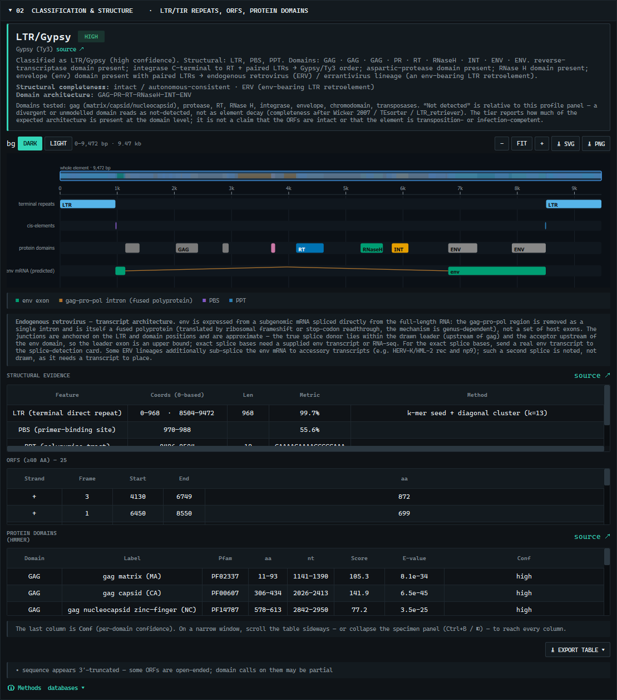
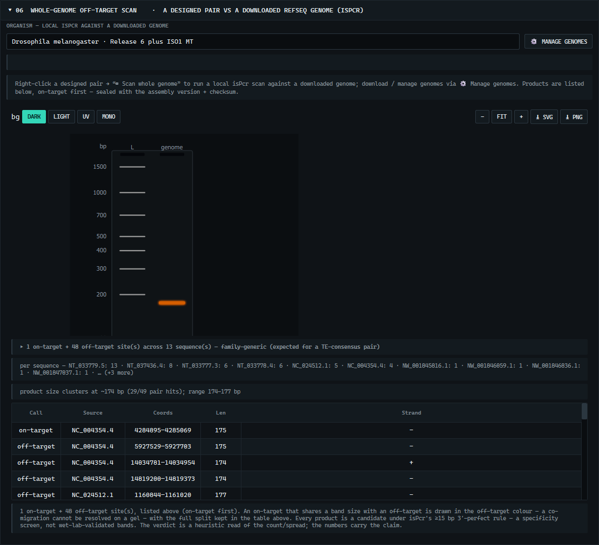

<div align="center">
<picture>
  <source media="(prefers-color-scheme: dark)" srcset="docs/img/teagle-banner-dark.png">
  
</picture>

   
</div>

**TEagle** is a native Windows desktop tool that annotates transposable elements, reads their gene structure, and designs TE-aware PCR primers — all in one window, no command line, with every result reproducible from the exact database and software versions that produced it. The scientific core (structural detection, HMMER protein-domain scanning, superfamily classification, Primer3 design, dual-engine primer QC, in-silico PCR, provenance) runs in-process; two optional features (Dfam family naming, de-novo splice) use a managed WSL backend the app installs for you.


> **License:** TEagle is proprietary software, provided here for reference and transparency — **not** open-source. You may download and run the official release for personal, academic, or research use; redistribution, modification, and reverse-engineering are not permitted. See [LICENSE](LICENSE).

## Install

1. Download **`TEagle-Setup-<version>.exe`** from the [Releases](../../releases) page.
2. Run it (per-user, no admin) and launch **TEagle**.
3. Paste a sequence, open a FASTA, or type an NCBI accession → **Run analysis**.

Everything the core needs — Python, PySide6, Primer3, HMMER (pyhmmer), ViennaRNA, and the CC0 Pfam TE-domain profiles — is bundled. Nothing to `pip install`, no command line. The optional Dfam/splice backend installs from within the app (**03 → Backend installer**, one click per component, with repair and integrity checks).

## What it does

- **Classify** an element from its structure (LTR/TIR/TSD/poly-A, ORFs) and its protein-domain architecture, into a superfamily under the Wicker 2007 scheme — Copia vs Gypsy by strand-aware integrase-vs-RT order, LINE, DNA transposons.
- **Full retroviral GAG–POL–ENV coverage** — the 21-model Pfam panel spans gag (matrix/capsid/nucleocapsid), pol (PR/RT/RNaseH/INT), and env, so an endogenous retrovirus (HERV-K, -W, -L, …) is read as a complete element and flagged as an ERV.
- **Reliability, honestly** — a per-domain confidence (from the HMMER E-value) plus a categorical structural-completeness tier (*intact / near-complete / partial / structural-only*, after Wicker 2007 / TEsorter / LTR_retriever), always scoped to the models tested.
- **Retroviral transcript architecture, not a host gene model** — an endogenous retrovirus is read the way a retrovirus is expressed: env from a spliced subgenomic mRNA, the gag–pro–pol span drawn as the single frameshift-fused intron (junctions labelled approximate, never guessed from motifs), alongside the LTR **cis-elements** (primer-binding site, polypurine tract). The misleading host exon–intron view is de-emphasised for an ERV.
- **Name the family** (optional, WSL) against the curated Dfam 4.0 library, and **resolve exon–intron structure** from a transcript with minimap2.
- **Design and screen primers** — Primer3 with presets and full parameters; every pair carries a **dual-engine secondary-structure check** (hairpin / self-dimer / cross-dimer / 3′-end ΔG, Primer3 cross-checked against ViennaRNA); pair-aware **in-silico PCR** as a to-scale gel; and a local **whole-genome off-target scan** against a downloaded RefSeq genome, with on-target/off-target framing.
- **Reproducible by construction** — every result carries a provenance manifest sealing the exact tool/database versions, parameters, and input checksums; fetched sequences and genomes are content-addressed.






## Full guide

The complete, illustrated user guide — every panel, every option, and how to read every result — ships as **`TEagle-User-Manual.pdf`** with each release. Fetch-by-coordinate, the backend installer, splice detection, the whole-genome scan, and the reproducibility record are all documented there.

## Develop / build

```powershell
python app/teagle.py             # native window (first run auto-installs pinned deps)
python app/teagle.py --selftest  # headless bundle self-test (imports + QtSvg + a real analysis)
python -m pytest tests/ -q       # test suite (300+ hermetic tests; @wsl/@network gated separately)
powershell -File installer/build_installer.ps1   # freeze (PyInstaller) + self-test gate + Inno Setup
```

## Reproducibility

Every analysis packs the databases and package versions plus input checksums that produced it, so a run reproduces byte-for-byte on another machine. The seal excludes volatile fields (retrieval timestamps, unused-tool versions), and derived/advisory annotations (the primer QC, the on/off-target labelling) are recorded but kept out of the seal so they never change a result's identity.
