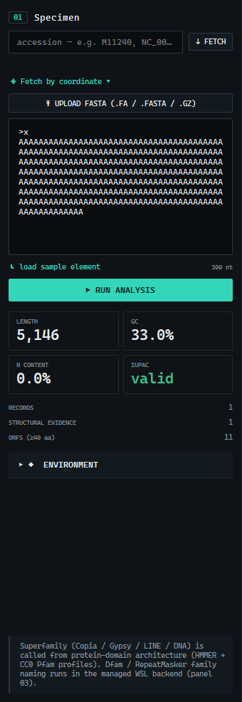
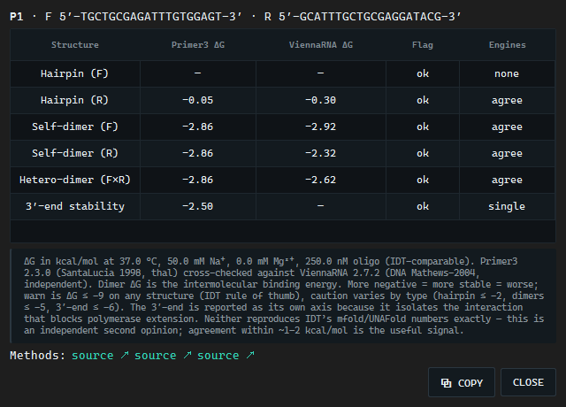
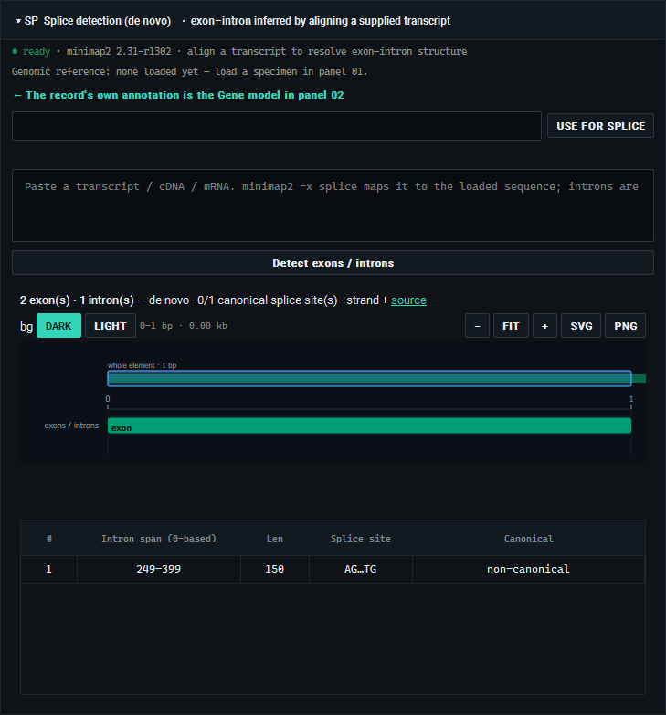
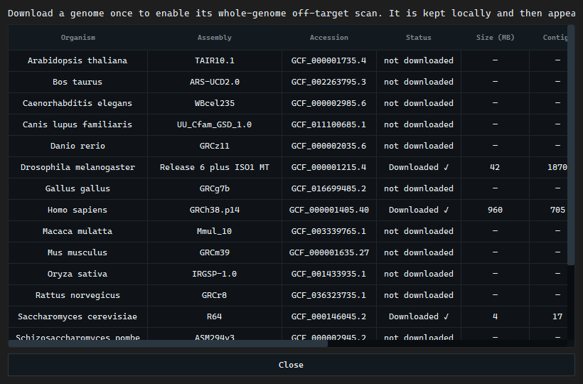

<div align="center">
<picture>
  <source media="(prefers-color-scheme: dark)" srcset="docs/img/teagle-banner-dark.png">
  
</picture>

   
</div>

Paste a sequence, open a FASTA file, or fetch an NCBI accession; detect and classify transposable elements with full evidence provenance; explore the results in an interactive genome viewer; and design purpose-specific PCR primers checked by pair-aware in-silico PCR with a to-scale gel — all in a native window, without a command line, and with every result reproducible from the exact database and software versions that produced it.

TEagle is a **native PySide6/Qt application**. The scientific core (sequence parsing, structural detection, HMMER protein-domain scanning, superfamily classification, Primer3 design, in-silico PCR, provenance) runs in-process — no browser, no local web server, no internet needed for the core workflow.


> **License:** TEagle is proprietary software. The source here is provided for reference and transparency; it is **not** open-source. You may download and run the official release for personal, academic, or research use, but redistribution, modification, and reverse-engineering are not permitted. See [LICENSE](LICENSE).

---

## Install and run — no setup, nothing to configure

For a wetlab researcher or anyone who does not want to touch code:

1. Download **`TEagle-Setup-<version>.exe`** from the [Releases](../../releases) page.
2. Run it (per-user install, no admin needed) and launch **TEagle**.
3. Paste a sequence, open a FASTA, or type an accession → **Run analysis**.

Everything the science needs — Python, PySide6, Primer3, HMMER (pyhmmer), and the CC0 Pfam TE-domain profiles — is bundled inside the app. There is nothing to `pip install`, no Python to set up, no command line. The app is a windowed build: it runs its background helpers silently, with no console or terminal windows flashing.

**Optional advanced features** (Dfam family-level naming, de-novo splice detection) use a Linux backend. They are entirely optional — the core workflow works without them. If you want them, open the built-in **backend installer** (panel **03 → Backend installer**): it lists every component (WSL2, micromamba, RepeatMasker, minimap2, the Dfam libraries, FamDB config) with a live status tick, installs them with one click, and lets you **repair any single component** or run a **check-integrity** pass. It needs Windows' built-in WSL2, which the installer guides you to enable. If WSL2 is absent or broken, TEagle says so plainly and the rest of the app keeps working.

### Run from source (developers)

```powershell
python app/teagle.py             # native window (first run auto-installs pinned deps)
python app/teagle.py --check     # environment check only
python app/teagle.py --selftest  # headless bundle self-test (imports + QtSvg + a real analysis)
python app/teagle.py --server    # legacy web UI over a local browser server
```

### Build the installer (maintainers)

```powershell
# needs PyInstaller (pip) + Inno Setup 6 (winget install JRSoftware.InnoSetup)
powershell -File installer/build_installer.ps1
```

This freezes the app with PyInstaller (`installer/teagle_native.spec`), runs the frozen-bundle self-test as a ship gate, then compiles `dist/TEagle-Setup-<version>.exe`.

---

## What it does

- **Input** — fetch an NCBI accession (e.g. `M11240`, `NC_003075.7`), **fetch by genomic coordinate** (UCSC-style `chr13:33,016,423-33,066,143`, single or multi-region), open a FASTA file (`.fa/.fasta/.fna/.gz`), or paste raw/FASTA DNA. Real IUPAC validation runs on analyze; RNA (`U`) is read as DNA.
- **Fetch by coordinate** — pick from 17 curated reference assemblies (human, mouse, rat, and other model species — or **Other organism / assembly…** to resolve any species or GCF/GCA accession via NCBI Datasets), choose the strand, and paste one or more loci in browser notation. Coordinates are 1-based inclusive, exactly as the UCSC/NCBI browser shows them; organism-specific chromosome names (`2L`, roman numerals, `X`, `MT`) resolve against the assembly's own map. The assembly, taxon, chromosome RefSeq accessions, coordinates, and strand are all sealed into the run manifest.
- **Structural evidence** — terminal direct repeats (LTR), terminal inverted repeats (TIR), target-site duplications (TSD), poly-A/poly-T tails, with 0-based coordinates and the detection method.
- **Protein domains** — native HMMER (pyhmmer) against a bundled CC0 Pfam TE-domain profile set (RT, integrase, RNase H, protease, GAG, chromodomain, hAT / Tc1-Mariner / DDE transposases), mapped back to nucleotide coordinates.
- **Superfamily classification** — Class I/II, Copia vs Gypsy by strand-aware integrase-vs-RT order, LINE, DNA (hAT / Tc1-Mariner), each with a confidence level and a generated, evidence-derived explanation.
- **Interactive genome viewer** — ruler, terminal-repeat / domain / ORF tracks, semantic zoom, pan, WYSIWYG SVG/PNG export, **hover a feature for its size and type**, and **right-click any feature** to copy its FASTA/DNA/coordinates or design a primer there — including the **5′/3′ flanks and inter-exon gaps** of a fetched record's gene model. The viewers **follow the app's dark/light theme** by default, and keep any per-viewer background you pick.
- **Primer design** — Primer3 with presets (standard / qPCR / high-specificity / permissive) and full advanced parameters, including domain-confined design.
- **In-silico PCR** — stage one or more primer pairs (one gel lane each); pair-aware amplicon search with a strict 3′ rule, mismatch control, and **IUPAC-degenerate primer support** (consensus / wobble primers, standard for TE work), including **single-primer (self-priming) products** across inverted repeats (TE terminal inverted repeats, LTRs). Rendered as a to-scale multi-lane agarose gel (dark / light / UV / mono) where **on-target, off-target, and single-primer bands are colour-coded**, equal-size products **co-migrate into one band** (the on-target colour is never hidden), **band intensity tracks priming efficiency** (mismatch count), and a lane with bands but no intended product is flagged; **hover a band** for its size and per-product calls, **right-click** to copy the amplicon.
- **Sortable, centered result tables** — click any header to sort (numeric-aware for score, E-value, aa, divergence, coordinates); the default keeps the engine's order. Every table exports to **CSV, TSV, and Excel (XLSX)** — the visible **Export table** button beside the protein-domain and Dfam family tables pops a format menu (the same choices are a submenu on every table's right-click), so you pick the format up front instead of hunting for it in a save dialog.
- **Copy / export everywhere** — right-click any structural, ORF, domain, family, or amplicon row to copy FASTA/DNA/coordinates/protein, design a primer, or **send the sequence to splice detection**; export amplicons to FASTA; every figure exports to SVG/PNG **in the background mode you have selected** (dark / light / UV / mono). Table headers carry plain-language tooltips, and each result panel links to its **source citation** (Wicker 2007, Pfam, Dfam, RepeatMasker, Primer3, minimap2, NCBI).
- **Send a sub-region of a feature** — right-click a structural feature, ORF, domain, or amplicon and pick a coordinate sub-interval (e.g. bases 150–400 of the feature); only that subset is routed to primer design or splice, so you target part of a domain rather than the whole feature.
- **Dual-engine primer secondary-structure QC** — hairpin, self-dimer, cross-dimer, and 3′-end ΔG for every pair, computed with Primer3 (SantaLucia 1998) and independently cross-checked against ViennaRNA, colour-flagged and shown side by side; advisory, and its method references are recorded but kept out of the run seal.
- **Transparent methods** — a one-click *Methods & databases* panel in the classification card states exactly what defines each layer: the Pfam TE-domain profiles and E-value for HMMER domains, the heuristic thresholds for the terminal-repeat detectors, the Wicker 2007 rules for the superfamily call, and Dfam 4.0 for family naming.
- **Fits your screen** — a global UI-scale setting (75–150%, persisted) and a collapsible specimen panel (Ctrl+B) let the whole interface fit a small laptop display without horizontal scrolling.
- **Dfam / RepeatMasker family naming** (optional, WSL) — RepeatMasker 4.2.4 against the Dfam 4.0 curated library, one-click managed install; pick the organism from a dropdown of common model species (or type any lineage under "Other").
- **De-novo splice detection** (optional, WSL) — minimap2 spliced alignment of a transcript against the loaded genomic reference (shown in the panel), with canonical GT–AG splice-site checking and an **advisory cross-check** of the alignment against the fetched record's own feature-table annotation. Right-click any feature to send its sequence straight to the splice tool.
- **Whole-genome off-target scan** (optional, WSL) — download an organism's RefSeq genome once (through NCBI Datasets, from the tabular **Manage genomes** panel), then right-click a designed primer pair to scan it for off-target priming sites with UCSC isPcr, entirely on your machine. The scan menu only offers genomes you have already downloaded and verified, so the search runs with **no remote query and no server-side queue** — validated end-to-end on the yeast, *Drosophila*, and human genomes. Candidate off-target products render as a to-scale gel + coordinate table, led by a plain-language **specificity verdict** — locus-specific, low-copy, or *family-generic* (expected for a TE-consensus pair) — with a per-chromosome breakdown and product-size cluster. The run is **sealed reproducibly** by assembly accession, source-genome checksum, and isPcr version.
- **Provenance + export** — every result carries a run manifest (database + tool versions, checksums, parameters, environment) and source-verified citations.

Every value on screen is computed live. There is no mock data.

## In the app

**Fetch by coordinate** — pick a reference assembly, choose the strand, and paste one or more loci in UCSC browser notation. The panel resolves each chromosome to its versioned RefSeq accession and reports the exact base span; the assembly, taxon, coordinates, and strand are sealed into the run manifest.



**Primer design** — Primer3 with presets and full advanced parameters; each pair links to its source citation, and a right-click sends it straight to in-silico PCR. Every pair is screened for secondary structure — **hairpin, self-dimer, cross-dimer, and 3′-end** free energies (ΔG, kcal/mol) the way IDT OligoAnalyzer reports them — and, because a single engine can disagree with the numbers seen elsewhere, each value is computed with **two independent** nearest-neighbor engines: **Primer3** (SantaLucia 1998) cross-checked against **ViennaRNA** (DNA parameters), shown side by side. A pair is flagged only when the two engines agree (amber ≤ −5, red ≤ −9 kcal/mol; the 3′ end weighted more strictly), and a ‡ marks a disagreement. Right-click → *Secondary-structure detail* for the full dual-engine breakdown. Validated against 12 published primer pairs (PrimerBank, Funakoshi 2017, Misak 2025): 11 of 12 carry no flag and the engines agree on 11 of 12.




**In-silico PCR** — stage one or more pairs (one lane each) and run a pair-aware amplicon search — including single-primer self-priming across inverted repeats — rendered as a to-scale multi-lane gel with a MW ladder. On-target, off-target, and single-primer bands are colour-coded, equal-size products co-migrate into one band, band intensity tracks priming efficiency, and lanes with no intended product are flagged; hover a band for its size and calls, right-click to copy the amplicon.


**Whole-genome off-target scan** (optional, WSL) — first download an organism's genome from *⚙ Manage genomes* (a tabular panel with per-row download / delete); it then appears in the scan menu, which lists only genomes you have actually downloaded. Right-click a designed pair and choose *Scan whole genome for off-targets*: the scan runs on your machine with UCSC isPcr — no remote query, no server-side queue — and renders in its own result panel, separate from the in-silico PCR gel. When the specimen was fetched at a known position in the scanned assembly, the product overlapping that position is marked the **on-target** and every other product an **off-target paralog**; the panel leads with a specificity verdict (*copy-specific* / *low-copy* / *family-generic* / *off-target-only*) and lists all on- and off-target products together — on-target first — with source, coordinates, length, and strand. An on-target that co-migrates with an off-target is drawn in the off-target colour as a specificity warning, with the full split kept in the table. When the primers are a bare consensus with no genomic position, each product is a neutral *genomic priming site* rather than an off-target. The result is advisory (candidate priming sites at isPcr's ≥15 bp 3′-perfect rule, not wet-lab-validated amplicons); the run is sealed by the assembly accession, source-genome checksum, and isPcr version for reproducibility.


**Backend installer** (optional) — a dedicated window installs the Linux (WSL) annotation stack component by component, each with a live status tick, a per-component **Repair** button, and a **check-integrity** pass. A failure in one component never blocks the others. If **WSL2 itself is missing**, an **Install WSL** action installs WSL2 + Ubuntu through an elevated (UAC) helper — no manual PowerShell needed — and tells you if a Windows restart is required.


**Dfam / RepeatMasker family naming** (optional, WSL) and **de-novo splice detection** — name the TE family against the Dfam 4.0 curated library, and resolve exon–intron structure by aligning a transcript to the loaded sequence with minimap2. A single-exon (gapless) result carries a plain-language caution that a genomic slice pasted as the transcript looks the same as a true single-exon transcript.



**Manage genomes** — a tabular control panel lists every supported organism with its assembly, accession, download status, cached size, and per-row download / delete, so the whole-genome off-target scan only ever offers genomes you have actually downloaded and verified.



## Reproducibility (top-priority constraint)

Every analysis and primer run embeds a **run provenance manifest**: exact database names + versions + checksums, tool versions, all parameters, accession versions, sequence checksums, and environment. The seal is content-addressed and refetch-invariant (it excludes volatile fields like timestamps and NCBI-vs-ENA header variation). Runs are immutable; every export carries the manifest and states which analyses were *not* run.

## Verify it yourself

```powershell
python -m pytest -m "not network and not wsl"   # full hermetic suite (backend + engine + native Qt)
```

The native UI is covered by headless Qt tests (figure rendering, the engine worker's error taxonomy, the analyze → design → in-silico-PCR workflow, WSL-degradation paths, and the staleness guard). Scientific validity is pinned by golden fixtures — copia (M11240) → LTR/Copia, gypsy (M12927) → LTR/Gypsy, L1 (M80343) → LINE, Tc1 (X01005) → DNA/Tc1, Ac (X05424) → DNA/hAT — all routed through the same in-process `engine.run_analyze` the app uses. Because the native app and the legacy browser UI call that same engine, they cannot diverge.

---

## Repository layout

| Path | What it is |
|---|---|
| `app/native/` | The native PySide6 app: shell, threaded engine worker, figure builders, widgets, backend-installer dialog. |
| `app/backend/` | The scientific engine. `engine.py` is the single source of truth (validated per-operation functions); `teagle_core/` holds the science; `server.py` is a thin HTTP adapter for the legacy web UI. |
| `app/web/` | Legacy browser UI (kept for `--server` / headless use). |
| `installer/` | `teagle_native.spec` (PyInstaller), `teagle_native.py` (launcher), `teagle.iss` (Inno Setup), `build_installer.ps1`. |
| `tests/` | Hermetic pytest suite + golden fixtures. |

---

*Scientific claims are traceable to stored evidence; external facts are traceable to their cited sources. Nothing here asserts wet-lab validation from in-silico results.*
