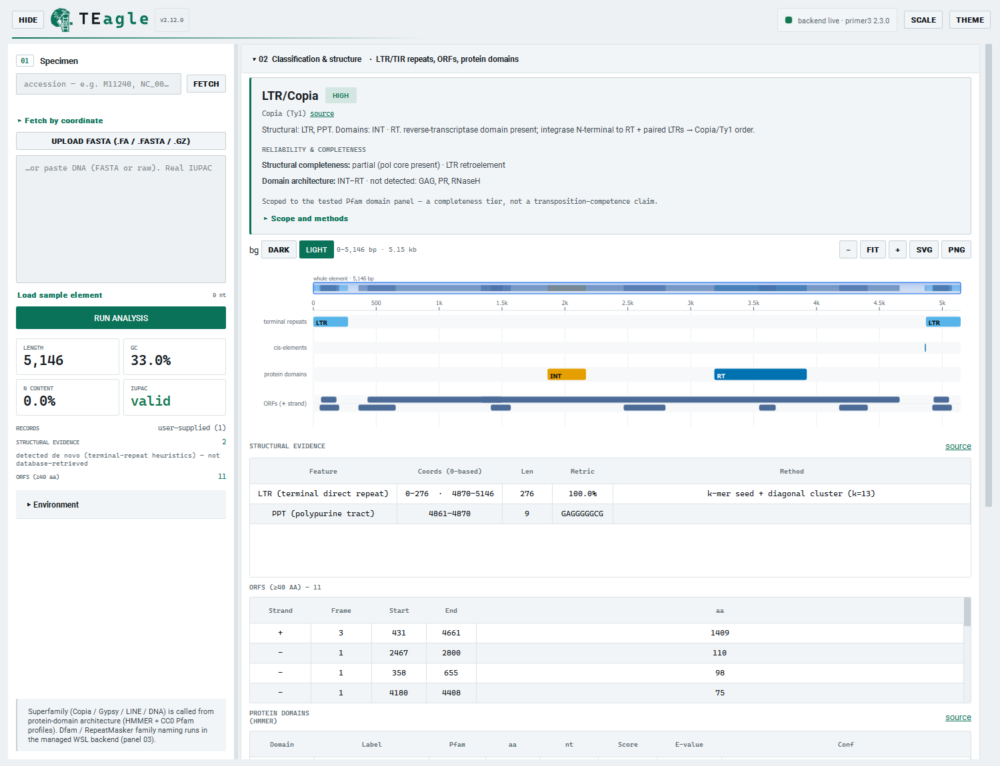
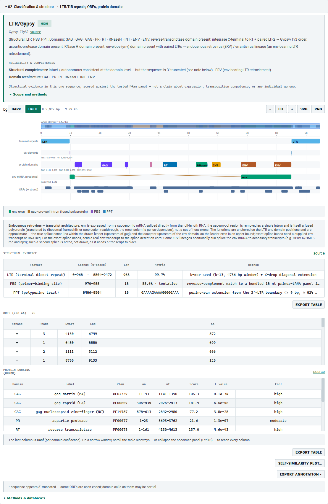
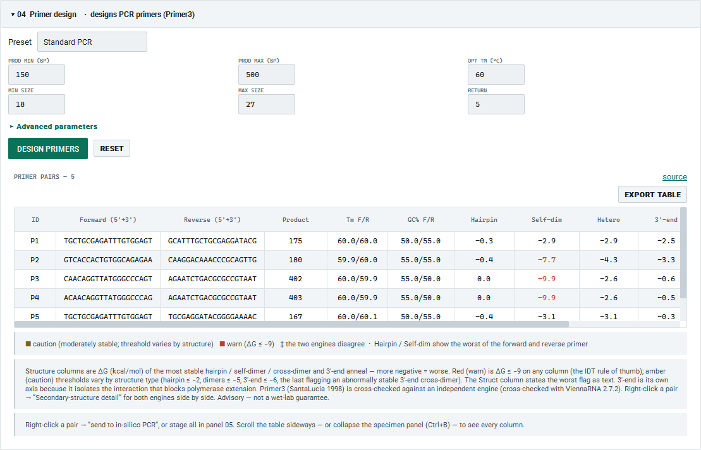
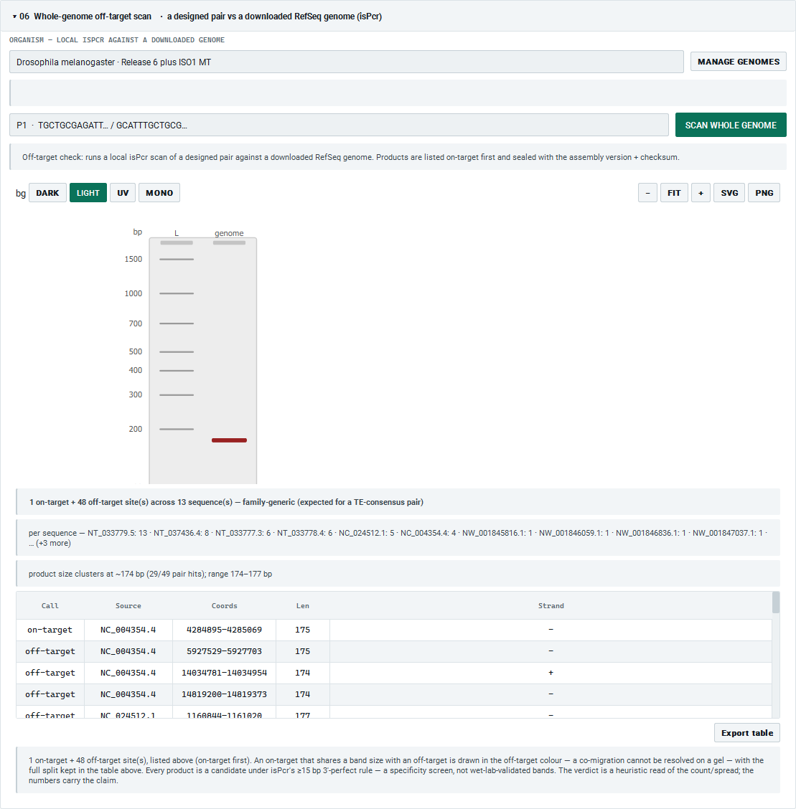

<div align="center">
<picture>
  <source media="(prefers-color-scheme: dark)" srcset="docs/img/teagle-banner-dark.png">
  
</picture>

   
</div>

**TEagle** takes one transposable element and tells you what it is, how it is built, and how to amplify it — in one window, without a command line, and with every result carrying the exact software and database versions that produced it.



## Why it exists

Naming an element, reading its internal structure, and designing a PCR assay for it are normally three separate jobs across three tools, each with its own input format and none of which records how it reached its answer. TEagle joins them, and is built on one rule: **a result must not claim more than its evidence supports.** Where the evidence is thin, the tool says so on screen rather than rounding up to a confident-sounding answer.

It is written for someone who runs benches — not a bioinformatician, not a programmer.

## What it is not

Being clear about this saves time:

- **Not a genome assembler or a variant caller.** It analyses sequence you give it.
- **Not a discovery tool for new TE families.** It recognises families that are already in the library it searches. Finding families nobody has described yet is what RepeatModeler2 and EDTA are for.
- **Not a replacement for wet-lab validation.** Primers are designed and screened *in silico*; the gel it draws is a prediction.
- **Not a web service.** Everything runs on your machine. It fetches sequences from NCBI when you ask it to, and never uploads yours.
- **Not a claim of completeness.** A family absent from the installed library cannot be reported, so absence is never evidence of absence — and the panel says which library was searched.

## Scope

| | |
|---|---|
| **Input** | One element or locus: pasted sequence, a FASTA file, an NCBI accession, or genomic coordinates. Up to roughly tens of kb. |
| **Also** | A whole downloaded genome, for a transposable-element landscape (families, copy numbers, coverage). |
| **Platform** | Windows 10/11, 64-bit. The optional Linux-only steps run in a WSL2 environment the app installs for you. |
| **Offline** | Everything except NCBI fetch and the one-time backend/genome downloads. |

## Getting started

1. Download **`TEagle-Setup-<version>.exe`** (≈ 40 MiB) from the [Releases](../../releases) page.
2. Run it — per-user, no administrator rights — and launch **TEagle**.
   *Windows will show a blue **“Windows protected your PC”** SmartScreen warning: the installer is not code-signed, so Windows has no publisher reputation for it. Click **More info → Run anyway**. On a managed or institutional laptop this prompt may be blocked outright, in which case your IT team has to approve the executable.*
3. Click **Load example element** for a bundled, published TE (or paste a sequence, open a FASTA, or type an NCBI accession) and press **Run analysis**.

That is the whole first run. Everything the core needs — Python, Qt, Primer3, HMMER and the CC0 Pfam TE-domain profiles — is inside the installer; there is nothing to `pip install`. The optional Linux backend (Dfam family naming, splice detection, whole-genome scans) installs from inside the app: click **BACKEND** in the window header (or the same button inside panel 03), one click per component, with repair and integrity checks. Components that are not there yet offer **Install**; each reports its download live in the window's log.

The illustrated guide to every panel ships with each release as **`TEagle-User-Manual.pdf`**; the scientific basis, methods and benchmarks are in the technical report.

> **License:** TEagle is free software under the **GNU Affero General Public License, version 3 or later** — see [LICENSE](LICENSE). You may use, study, modify and redistribute it under those terms. Because it is AGPL, anyone who runs a modified TEagle as a network service must also offer its source to the users of that service. Third-party components and their licences are listed in [THIRD-PARTY-NOTICES.md](THIRD-PARTY-NOTICES.md).

## How you use it

The window is a numbered sequence of panels. You work down it, and each panel fills in from the one above.

| | Panel | You do | You get |
|---|---|---|---|
| 01 | **Specimen** | Paste, upload, fetch an accession, or load an example → **Run analysis** | Length, GC%, validity, feature counts |
| 02 | **Classification & structure** | (fills in) | Superfamily call with the evidence behind it, an interactive map, terminal repeats, cis-elements, ORFs, protein domains |
| 03 | **Dfam family** | Set the species, choose the family library → **Run family annotation** *(needs the Linux backend)* | The community family name, with divergence and score, and which library was searched |
| — | **Splice detection** | Paste a transcript *(needs the backend)* | Exons and introns resolved by alignment |
| 04 | **Primer design** | Pick a preset or open the parameters → **Design primers** | Ranked pairs with Tm, GC, product size and a secondary-structure check |
| 05 | **In-silico PCR** | Load pairs → **Run** | A to-scale gel and an amplicon table |
| 06 | **Whole-genome scan** | Choose a downloaded genome | On- and off-target priming across the genome |
| 07 | **Run provenance** | (fills in) | The versions, checksums and parameters behind the result |

Right-click almost anything — a table row, a feature in the map, a band on the gel — for actions that fit *that* item: copy its sequence or coordinates, take its flanks, design a primer there, or send it onward.

Separately, **Manage genomes → Annotate TE landscape** runs a whole downloaded genome and reports which TE families live in it and how much of it they occupy.

## What it does

Short version — the manual explains each in full.

**Reads an element.** Terminal repeats (LTR/TIR), target-site duplications, tails, ORFs, and protein domains from a 30-model Pfam panel spanning all four TE classes. For an LTR element it also reads the cis-elements: primer-binding site, polypurine tract, the terminal motif, and the polyadenylation-signal motif.

**Calls a superfamily, with its reasons — and declines when it cannot.** Copia versus Gypsy from strand-aware integrase-vs-RT order, LINE, DIRS, ERV, and the DNA-transposon superfamilies — under the Wicker 2007 scheme, with the domains that support the call listed beside it. Where the evidence cannot carry a call the element is reported as undetermined rather than guessed: an integrase and RT on opposite strands, or on overlapping spans, leave the order unreadable, so no Copia/Gypsy call is made.

**States how much to trust it.** A per-domain confidence from the HMMER E-value, and a categorical completeness tier (*intact / near-complete / partial / structural-only*) — always scoped to the models actually tested. An endogenous retrovirus is read as a retrovirus, with env from a spliced subgenomic mRNA rather than a misleading host gene model.

**Names the family** against Dfam, and **resolves exons and introns** from a transcript (both optional, via the Linux backend).

**Designs and screens primers.** Primer3 with presets or full parameters, a secondary-structure check on every pair (cross-checked against a second engine when ViennaRNA is installed), pair-aware in-silico PCR drawn as a to-scale gel, and a whole-genome off-target scan against a genome you have downloaded.

**Annotates a whole genome's TE landscape** — which families, how many copies, how much of the assembly, how diverged — counting transposable elements separately from tandem and non-TE repeats, and telling you before the run whether the installed library can find TEs in your organism at all.

**Exports everything.** Tables to XLSX/CSV/TSV, figures to SVG/PNG (the self-similarity dot plot also exports vector PDF), sequence to FASTA, annotation to GFF3/BED with verified Sequence Ontology terms, and a provenance manifest sealing the versions, parameters and checksums behind the result.







## Where to read more

- **`TEagle-User-Manual.pdf`** (ships with each release) — the illustrated guide: every panel, every option, what each number means and how to read it. Start here.
- **Technical report** — the scientific basis of each step, the third-party tools and why each was chosen, and the benchmarks with their literature sources.
- **[CHANGELOG.md](CHANGELOG.md)** — what changed in each version, including any change that can move a reported value.

## Develop / build

```powershell
python app/teagle.py             # native window (first run auto-installs pinned deps)
python app/teagle.py --selftest  # headless bundle self-test (imports + QtSvg + a real analysis)
python -m pytest tests/ -q       # hermetic test suite (@wsl / @network sets gated separately)
powershell -File installer/build_installer.ps1   # freeze + bundle guard + self-test gate + Inno Setup
```

## Reproducibility

Every analysis packs the databases and package versions plus input checksums that produced it, so a run reproduces byte-for-byte on another machine. The seal excludes volatile fields (retrieval timestamps, unused-tool versions), and derived/advisory annotations (the primer QC, the on/off-target labelling) are recorded but kept out of the seal so they never change a result's identity.
