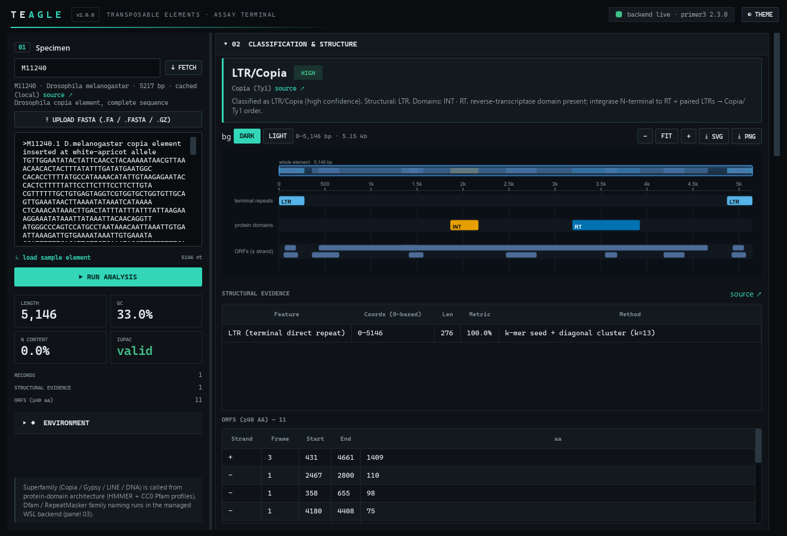
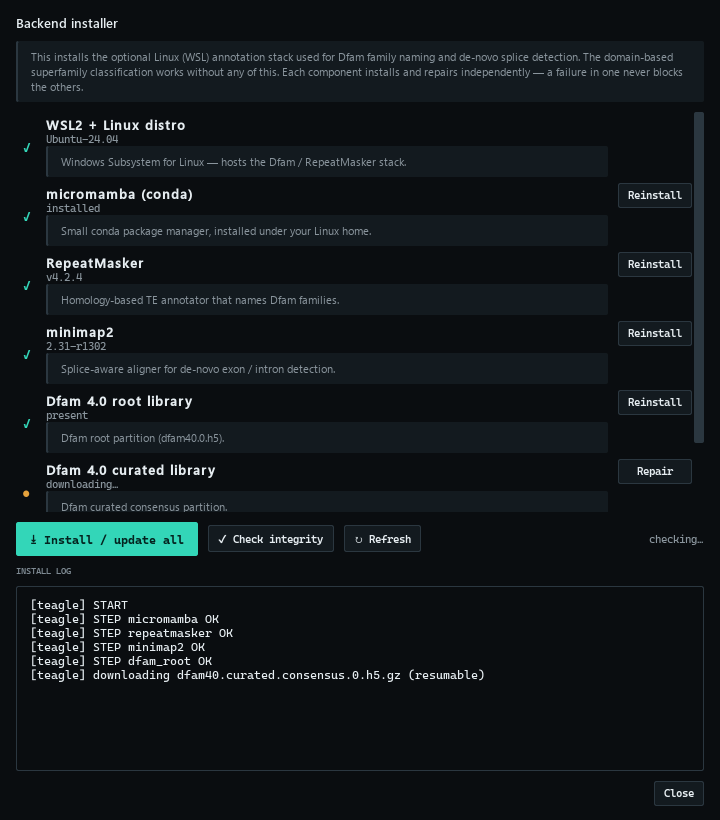

# TEagle — running the app (plain-language guide)

This is the **working** TEagle application — a **native Windows desktop app** (PySide6/Qt). Everything it shows is **computed live on your machine** — there is no fake data. It does these real things right now:

1. **Reads a DNA sequence** — paste, FASTA, or **fetch by accession live from NCBI** — and checks it.
2. **Finds structural features** — LTRs (the repeated ends of some transposons), inverted repeats (TIRs), ORFs (protein-coding stretches), and tails.
3. **Detects protein domains** — reverse transcriptase, integrase, RNase H, protease, gag, transposase — using **HMMER** against bundled CC0 **Pfam** profiles (runs natively, no Linux needed).
4. **Classifies the element** — Class I vs II, and superfamily: **Copia, Gypsy, LINE, hAT, Tc1/Mariner** — from the domain architecture. Copia vs Gypsy is decided by the diagnostic **integrase-vs-RT order**, exactly as in the literature.
5. **Designs PCR primers** with **Primer3**, including **domain-specific PCR** (primers placed inside a chosen domain).
6. **Runs in-silico PCR** — predicts which product(s) your primer pair would make, shown as a gel.

7. **Names the Dfam family** — via a managed **WSL backend** (RepeatMasker 4.2.4 + Dfam 4.0 curated). On *Drosophila* copia it returns `Copia_LTR` + `Copia_I` · LTR/Copia, with divergence and score.

> Everything is real and computed; nothing is guessed or faked. The one part that needs Linux — RepeatMasker/Dfam — runs in **WSL2**, which TEagle detects, installs (checksum-verified), and reports on inside the app (panel 03). Superfamily (Copia/Gypsy/LINE/DNA) also works natively from domains, so you get a result even before the WSL backend is set up.



Right-click any structural, ORF, domain, family, or amplicon row — or any feature in the genome viewer or gel — to copy its FASTA/DNA/coordinates/protein or design a primer there; hover a table header for a plain-language definition, or a figure feature for its size and type. Every table exports to CSV/TSV and every figure to SVG/PNG.

## The WSL backend (Dfam / RepeatMasker family naming)

Family-level naming (e.g. `Copia_I`, `Gypsy-2_DM`) uses tools that only run on Linux, so TEagle manages a **WSL2** environment for them — you never touch a Linux shell.

- **Panel 03 “Dfam / RepeatMasker family”** shows the backend status. Click **Backend installer** to open a window that lists every component (WSL2, micromamba, **RepeatMasker 4.2.4**, minimap2, the **Dfam 4.0** libraries, FamDB config) with a live status tick. Install them all with one click, **repair any single component**, or run a **check-integrity** pass; the Dfam libraries are downloaded from a pinned, md5-verified source into WSL. One time, ~a few minutes.


- Once ready, set the **species** (auto-filled from a fetched accession's organism) and click **Run family annotation**. TEagle runs RepeatMasker (RMBLAST) against Dfam in WSL and lists the family hits with coordinates, divergence and score — Layer-A homology evidence that complements the domain-based superfamily.
- Coverage depends on the installed Dfam partitions; the curated set names families for well-studied organisms. Security: your sequence is piped to WSL as data, never built into a shell command.

---

## Run it

**If you installed the app** (`TEagle-Setup-<version>.exe`): just launch **TEagle** from the Start menu or desktop. Nothing else to install — Python, Qt, Primer3, HMMER, and the Pfam profiles are all bundled inside the app.

**From source** (developers) you need **Python 3.10+** (you have 3.12). Open a terminal in the `TEagle` folder:

```powershell
python app/teagle.py             # native PySide6 window
python app/teagle.py --check      # just run the environment check and print it
python app/teagle.py --selftest   # headless self-test (imports + figure rendering + a real analysis)
python app/teagle.py --server     # legacy browser mode → http://127.0.0.1:8765
```

From source, the first run — and again after any upgrade — checks Python and the pinned packages and installs them for you, then starts. It records a signature so it doesn't reinstall on every launch. If an install fails it says so and refuses to start on a broken environment (never a silent half-start). The in-app **Environment** panel shows the live status (Python, packages, WSL2).

No command-line bioinformatics, no Linux needed for the core workflow.

## Fetch by accession (live)

Type a nucleotide accession in the Specimen box — e.g. **`M11240`** (Drosophila copia), **`NC_003075.7`** (Arabidopsis chr4), **`X05424`** (maize Ac) — and press **Fetch**. TEagle retrieves it from NCBI, shows the organism / taxid / length / title so you can **verify before analyzing**, and fills the sequence. Invalid or unknown accessions give a clear error, never a wrong sequence.

You can also **Upload FASTA** — a `.fa` / `.fasta` / `.fna` / `.txt` file, or a gzipped `.gz` (decompressed in the app) — instead of pasting or fetching.

Fetched sequences are **cached locally** (`.teagle/cache/fetch/`), so re-fetching the same accession is instant and offline — TEagle does not re-download the same organism every run. A cached fetch is labelled **"cached (local)."** The cache **pins the first-fetched version**: because an accession version (e.g. `M11240.1`) is immutable, the cached FASTA and its original retrieval time travel unchanged with every result. If NCBI later releases a newer version, a bare-accession query keeps serving the pinned one — fetch the explicit `.N`, or force a refresh, to move to it. The cached record still carries the exact `accessionversion` and retrieval timestamp, so provenance is honest.

## Using it

| Panel | What to do | What you get (all real) |
|---|---|---|
| **01 Specimen** | **Fetch** an accession, paste DNA, or click **“load sample element.”** Press **Run analysis**. | Length, GC%, N%, IUPAC validity; counts of structural features and ORFs. |
| **02 Structure** | (auto-fills after analysis) | An interactive map (zoom / pan / export SVG+PNG) + tables: LTR/TIR spans, protein domains, ORFs, method used. If you **fetched** an annotated accession, a **gene-structure** figure + table shows its exons / introns / CDS straight from the record. |
| **Splice detection** | Paste a transcript / cDNA, press **Detect exons/introns** (needs the WSL backend). | De-novo exon–intron structure by spliced alignment (minimap2), with each intron's splice site checked against canonical GT–AG. |
| **Primer design** | Pick a **preset** (Standard / qPCR / High-specificity / Permissive) or open **Advanced parameters**, press **Design primers**. | Real Primer3 pairs — sequences (3′ end underlined = specificity-determining), Tm, GC, product size. |
| **In-silico PCR** | **Load** one or more pairs into the engine (reorder by drag or ↑ ↓, remove with ✕), optionally paste a background, press **Run**. | A **gel** (dark / white / UV / monochrome, exportable) with the predicted band(s), one lane per pair, and a table: on-target vs off-target, mismatches, coordinates. |
| **Run provenance** | (auto-fills) | The exact tool versions, checksums, parameters and environment behind the result — so any run is reproducible. |

## Scope

The in-silico PCR primer scan is a direct O(n·m) search, bounded by a hard cap on binding sites and amplicons so a repetitive template cannot exhaust memory. It is tuned for **single loci / elements** (up to ~tens of kb), not whole chromosomes; large-genome streaming and indexed search remain future work.

## Honesty rules the app follows

- It never says a primer is “specific.” It says *“no additional amplicon was predicted in the searched sequences under these criteria”* — and lists what was **not** searched.
- Structural findings are **candidate evidence**, never a family name.
- A source it did not run is shown as **not run**, never as a negative result.
- Every result carries the versions + checksums that produced it (see panel 05), **plus source-verified citations** for every database/tool used (Pfam, HMMER, Primer3, NCBI, Wicker 2007) with DOIs.
- **Click any detected domain** to see its DNA + protein sequence and copy it (DNA / protein / FASTA), or design a primer inside it.

## Verified against real transposable elements

`python verification/verify_organisms.py` fetches **13 well-characterised TEs from 13 organisms** live from NCBI and checks the app's detection against each element's published signature. Result: **11/13 PASS** — LTRs found in copia (*Drosophila*), Ta1 (*Arabidopsis*), Tnt1 (tobacco), Ty1 (yeast), IAP (mouse); TIRs in Ac (maize, 11 bp), Tc1 (*C. elegans*, 54 bp), mariner, and the rice mPing MITE; LINE signatures in human L1 and *Drosophila* Doc. Detected sizes match the literature (e.g. copia LTR 276 bp, human L1 ORF2 1275 aa). The 2 "ANALYZED" cases (barley BARE-1 in a 13 kb flanked record; medaka Tol2's atypical ends) are reported honestly as heuristic limits, not hidden. Full table: **[verification/organism_studies.md](../verification/organism_studies.md)**. Re-runs are deterministic (metadata + FASTA cached).

## What’s under the hood

- `backend/teagle_core/` — the real science (pure Python): `sequtil` (parse/validate/GC/N/reverse-complement/ORFs), `structural` (LTR/TIR/TSD/poly-A detection), `domains` (HMMER/pyhmmer), `classify` (superfamily), `primers` (Primer3 design + pair-aware in-silico PCR), `provenance` (the run manifest).
- `backend/engine.py` — the single source of truth: one validated function per operation, returning a result or raising a clear input error. Both the native app and the legacy web server call it.
- `native/` — the native PySide6 app (the “assay terminal”): `main.py` (window + panels), `engine_worker.py` (runs the engine off the UI thread), `figures.py` (genome viewer + gel SVG), `widgets.py` (interactive figure/table widgets).
- `backend/server.py` + `web/` — the legacy browser UI, kept for `--server` / headless use; it displays the same engine results.

Dependencies are pinned in `backend/requirements.txt` for reproducibility.
